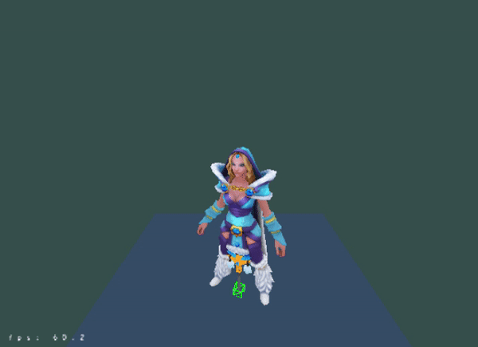

# A Simple Opengl Engine

### The Result


### External Library
> use [assimp](https://github.com/assimp/assimp.git) library to load model such as fbx、obj  
> use glfw glad to manager opengl

### How to Build and Run
```bash
git clone https://github.com/superman-t/OpenglLearn.git
cd OpenglLearn
git submodule update --init --recursive

mkdir build
cd build

cmake .. -G "Visual Studio 14 2015 Win64"
cmake --build . --config Release
start build/Release/OpenglLearn.exe
```